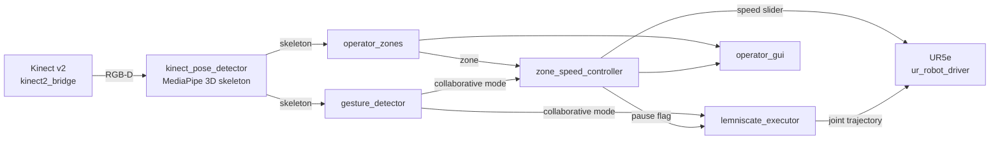
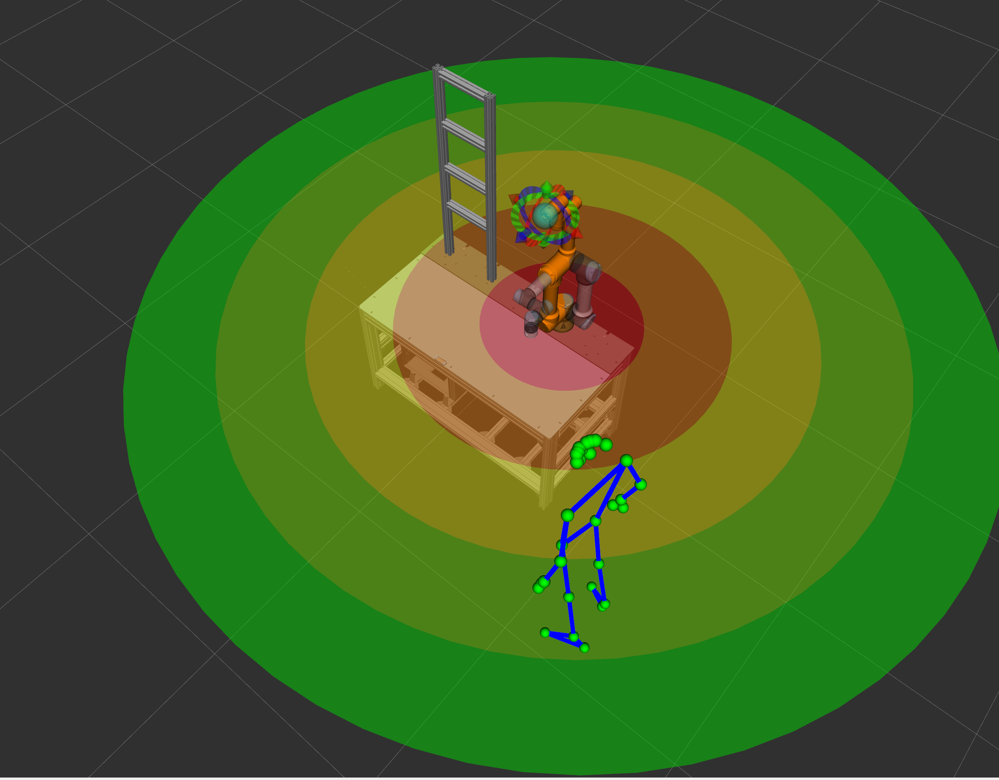

# UR5e workspace zone-based speed control with 3D sensor

**Bachelor Thesis Project** - Dynamic speed regulation of robotic arm based on workspace zones detected with 3D sensor. The system adjusts robot motion speed depending on operator proximity to ensure safe and efficient human-robot collaboration.

Developed system is dependent and verified on **COCOHRIW (COmplex COllaborative Human-Robot Interaction WorkPlace)**, a research project of **the Department of Robotics of the Institute of Robotics and Cybernetics of the FEI STU in Bratislava**, which focuses on the use of modern sensory devices in human-robot interaction (or with a robotized workplace).

Project uses kinect v2 ToF camera and MediaPipe pose estimation models for operator detection in robot workspace.

## Overview



- The Kinect v2 RGB-D stream is lifted to a metric 3D operator skeleton with MediaPipe Pose (`kinect_pose_detector`).
- The workspace around the robot base is split into configurable distance zones; the operator's nearest joint determines the active zone (`operator_zones`).
- A state machine maps the active zone to a UR5e speed limit through the driver's speed slider, pauses the robot in the danger zone and on perception loss, and resumes when safe (`zone_speed_controller`).
- A hands-raised gesture toggles the collaborative mode on and off (`gesture_detector`).
- The robot runs a continuous figure-8 (Gerono lemniscate) demo trajectory, generated as IK-solved waypoints with C2-continuous cubic-spline timing via MoveIt; the pause flag stops it in place with a phase-exact resume, while leaving collaborative mode parks it at home (`lemniscate_executor`).
- A fullscreen GUI shows the current zone, mode and motion state to the operator (`operator_gui`).

Every package keeps the ROS interface separated from pure logic: `*_node.cpp` / `*_ros.cpp` / `*.cpp` in C++, ROS-free logic classes in Python, so the core algorithms are testable without ROS (with some exceptions).

## Packages

| Package | Language | Role |
| --- | --- | --- |
| [zone_speed_controller](src/robot_control/zone_speed_controller/) | C++ | Zone to speed limit FSM, danger-zone pause, perception watchdog |
| [lemniscate_executor](src/robot_control/lemniscate_executor/) | C++ | Continuous figure-8 trajectory via MoveIt and FollowJointTrajectory |
| [flag_grasper](src/robot_control/flag_grasper/) | C++ | Wrist rotation + Robotiq gripper flag-grasp routine |
| [kinect_pose_detector](src/operator_detection/kinect_pose_detector/) | Python | MediaPipe 3D operator skeleton from Kinect RGB-D |
| [operator_zones](src/operator_detection/operator_zones/) | Python | Distance to zone classification, RViz zone visualization |
| [gesture_detector](src/operator_detection/gesture_detector/) | Python | Hands-raised gesture FSM for collaborative mode |
| [operator_gui](src/operator_detection/operator_gui/) | Python | Fullscreen operator status display |
| [operator_detection_common](src/operator_detection/operator_detection_common/) | Python | Shared skeleton keypoint constants |
| [save_kinect_rgbd](src/operator_detection/save_kinect_rgbd/) | C++ | Single-shot RGB-D frame capture utility |

Third-party submodules under [src/submodules/](src/submodules/): [COCOHRIW_cell_control](https://github.com/SUT-robotics-HRI-Lab/COCOHRIW_cell_control) (cell description, MoveIt config, UR and gripper control) and [kinect2_ros2](https://github.com/krepa098/kinect2_ros2) (Kinect v2 driver).

Each package has its own README with the full ROS interface, parameters and design notes.

## Installation

Prerequisites:

- Ubuntu 24.04 with ROS 2 Jazzy Jalisco
- [libfreenect2](https://github.com/OpenKinect/libfreenect2) built from source (no apt package exists)

```bash
git clone --recurse-submodules https://github.com/dmitriiognev/ur5e-zone-speed-control.git
cd ur5e-zone-speed-control

# ROS dependencies (MoveIt, cv_bridge, UR driver, ...)
rosdep install --from-paths src --ignore-src -r -y

# Perception dependencies (system Python, not a venv)
pip install mediapipe

# MediaPipe pose models (not committed, ~45 MB)
cd src/operator_detection/kinect_pose_detector/models
wget https://storage.googleapis.com/mediapipe-models/pose_landmarker/pose_landmarker_lite/float16/1/pose_landmarker_lite.task
wget https://storage.googleapis.com/mediapipe-models/pose_landmarker/pose_landmarker_full/float16/1/pose_landmarker_full.task
wget https://storage.googleapis.com/mediapipe-models/pose_landmarker/pose_landmarker_heavy/float16/1/pose_landmarker_heavy.task
cd -

# kinect2_calibration does not compile on Jazzy (upstream uses the pre-Jazzy cv_bridge header)
touch src/submodules/kinect2_ros2/kinect2_calibration/COLCON_IGNORE

colcon build
source install/setup.bash
```

Important:

- Deactivate any Python venv/conda before `colcon build` - CMake would otherwise pick the wrong interpreter.
- `leap_gesture_interface` (COCOHRIW submodule) requires the Ultraleap Hand Tracking SDK; without it build with `colcon build --packages-skip leap_gesture_interface`.

## Usage

Robot side (terminal 1) and perception/control pipeline (terminal 2):

```bash
ros2 launch launch/bringup_real.launch.py robot_ip:=192.168.0.5
ros2 launch launch/bringup_pipeline.launch.py
```

Without the real robot, `launch/bringup_mock.launch.py` starts the UR driver on mock hardware with RViz; the perception side still requires a physical Kinect v2.

> Proper documentation and tests are being prepared. Currently key information documented in README.md in every package.

## Demos

Here's some raw material - a proper demo video is also being prepared.




## License

MIT - see [LICENSE](LICENSE).
