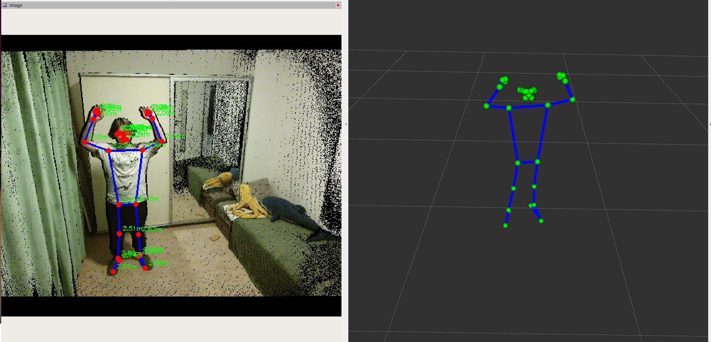

# gesture_detector

Toggles collaborative / non-collaborative mode when the operator holds both wrists above the nose.

## Overview

`gesture_detector_node` turns one hold gesture (both wrists above the nose) into a collaborative-mode flag on `/operator/collaborative_mode`.

It adds no perception of its own: it reads the skeleton that `kinect_pose_detector` already publishes, so the package is a thin consumer over an existing pose stream.

## Gesture

The gesture is "both wrists above the nose" in the world frame (Z up), using `LEFT_WRIST`, `RIGHT_WRIST`, and `NOSE` from `operator_detection_common.keypoints`.



Detection is a Schmitt trigger with two edges:

- **raised** (arms the hold) when both wrists clear the nose by `raise_margin`: `wrist.z > nose.z + raise_margin`.
- **lowered** (re-arms after a trigger) when either wrist drops back to nose level: `wrist.z <= nose.z`.

The band `[nose.z, nose.z + raise_margin]` between the two edges is a dead zone: jitter inside it changes nothing, so a wrist hovering at nose height cannot flicker the state.

## ROS interface

### Subscribed topics

| Topic | Type | Description |
| --- | --- | --- |
| `/pose/operator_skeleton` | `geometry_msgs/PoseArray` | Operator skeleton, 33 keypoints in `KEYPOINT_NAMES` order |

### Published topics

| Topic | Type | Description |
| --- | --- | --- |
| `/operator/collaborative_mode` | `std_msgs/Bool` | `true` = collaborative (normal), `false` = non-collaborative |

`/operator/collaborative_mode` is latched (transient-local): a subscriber that joins late immediately receives the current mode instead of waiting for the next toggle.

Topic names are overridable via the `operator_skeleton_topic` and `collaborative_mode_topic` parameters.

### Parameters

| Parameter | Default | Unit | Description |
| --- | --- | --- | --- |
| `hold_frames` | `20` | frames | Consecutive valid frames the gesture must hold before it triggers (~0.67 s at 30 fps) |
| `raise_margin` | `0.05` | m | Height the wrists must clear the nose to count as raised; re-arming needs them back at nose level (hysteresis band) |
| `operator_skeleton_topic` | `/pose/operator_skeleton` | — | Input skeleton topic |
| `collaborative_mode_topic` | `/operator/collaborative_mode` | — | Output mode topic |
| `qos_depth` | `10` | — | Subscriber queue depth for the skeleton stream |

Defaults live in `config/gesture_detector_node.yaml` (loaded by the launch file); override them via launch arguments or `ros2 param`.

## Related packages

- `kinect_pose_detector` - publishes `/pose/operator_skeleton`, the only input.
- `operator_detection_common` - the `KEYPOINT_NAMES` order and `is_invalid_joint` helper.
- `zone_speed_controller` - consumes `/operator/collaborative_mode` (freezes zone processing in non-collaborative mode).

## Build

```bash
colcon build --packages-select gesture_detector
source install/setup.bash
```

## Run

```bash
ros2 launch gesture_detector gesture_detector_node.launch.py
```

The node also runs standalone with its built-in defaults:

```bash
ros2 run gesture_detector gesture_detector_node
```

## Configuration

Increase `raise_margin` if accidental arm raises trigger the toggle, at the cost of requiring a more deliberate gesture.

Shorten `hold_frames` for a snappier trigger, at the cost of more false positives from brief arm raises.

## Processing pipeline

The node runs one finite-state-machine step per incoming skeleton frame.

1. Frames shorter than the full `KEYPOINT_NAMES` set are dropped (a malformed skeleton).
2. The two hysteresis edges (`raised`, `lowered`) are computed once from the three landmarks; if any of the three joints is invalid, both edges are `false`.
3. In `AWAITING_RELEASE` only the `lowered` edge is consulted; otherwise `raised` drives the hold counter.

An all-invalid skeleton (the producer's "no usable detection" signal) therefore counts as not raised and resets an in-progress hold to `IDLE`.

## Design notes

### Explicit state machine

The node is an explicit `GestureState` enum with one dispatcher (`_skeleton_callback`) and one intent-named helper per transition.

This mirrors the project's C++ convention in `zone_speed_controller` (`enum class State`).

### States and transitions

```
IDLE              -- no gesture in progress
HOLDING           -- raised edge held; counting consecutive frames
AWAITING_RELEASE  -- post-trigger; re-trigger blocked until the arms drop once

IDLE             --raised----------------------------> HOLDING
HOLDING          --not raised------------------------> IDLE
HOLDING          --held >= hold_frames (trigger)-----> AWAITING_RELEASE
AWAITING_RELEASE --lowered (arms back at nose)-------> IDLE
```

### Why AWAITING_RELEASE exists

After a trigger the operator's arms are usually still raised.

Without the release step the very next frame would start counting toward another trigger and the mode would flip back almost immediately.

`AWAITING_RELEASE` forces the gesture to be fully released once before a new hold can begin, so each deliberate raise produces exactly one toggle.

### Edge-triggered toggle

A single completed hold flips the mode and latches it; the node never re-asserts the flag while the gesture is held.

This keeps the contract symmetric: raise-and-release to enter non-collaborative mode, raise-and-release again to return.

## Known limitations and future work

`hold_frames` is a frame count, so the real hold time is `hold_frames / publish_rate` — not a fixed number of seconds.

That rate is whatever `kinect_pose_detector` actually delivers: ~30 fps nominally ($\approx$ 0.67 s for the default 20 frames), but lower whenever inference falls behind the frame budget and frames are skipped, which stretches the hold at runtime.

Counting the hold against the node clock instead of frames would make it a fixed wall-clock duration, independent of the publish rate.
