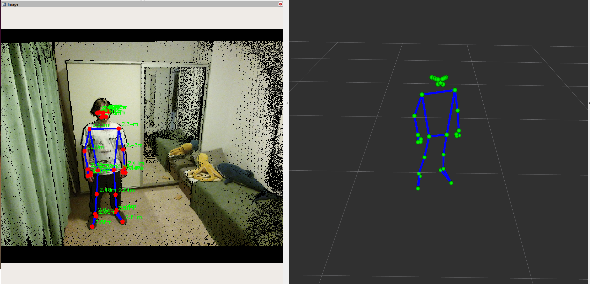
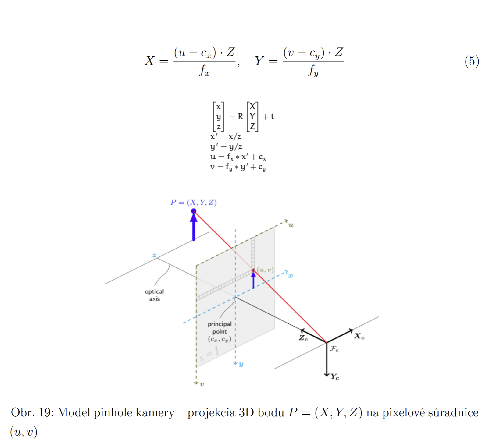

# kinect_pose_detector

MediaPipe-based 3D operator pose estimation in the robot workspace from a Kinect v2 stream.

## Overview

`pose_detector_node` synchronises the Kinect v2 RGB and depth streams, runs MediaPipe Pose on the RGB frame, lifts each 2D landmark to a 3D point using the registered depth and the camera intrinsics, filters the result, transforms it into the world frame, and publishes the operator skeleton.

The structured skeleton on `/pose/operator_skeleton` is consumed downstream by the zone and gesture nodes; the annotated image and markers are for visualisation only.



## ROS interface

### Subscribed topics

The `{res}` segment is the `resolution` parameter (`sd`, `qhd`, or `hd`).

| Topic | Type | Description |
| --- | --- | --- |
| `/kinect2/{res}/image_color_rect` | `sensor_msgs/Image` | Rectified RGB frame |
| `/kinect2/{res}/image_depth_rect` | `sensor_msgs/Image` | Rectified depth frame (16UC1, mm) |
| `/kinect2/{res}/camera_info` | `sensor_msgs/CameraInfo` | Intrinsics for the 3D lift |

### Published topics

| Topic | Type | Description |
| --- | --- | --- |
| `/pose/annotated_image` | `sensor_msgs/Image` | RGB with skeleton and per-joint distance overlay |
| `/pose/skeleton_3d` | `visualization_msgs/MarkerArray` | Joint and bone markers for RViz |
| `/pose/operator_skeleton` | `geometry_msgs/PoseArray` | Structured 3D skeleton for downstream consumers |

Output topic names are overridable via the `annotated_image_topic`, `skeleton_markers_topic`, and `operator_skeleton_topic` parameters.

### Parameters

| Parameter | Default | Unit | Description |
| --- | --- | --- | --- |
| `resolution` | `sd` | — | Kinect2 bridge stream: `sd`, `qhd`, or `hd` |
| `model_type` | `full` | — | MediaPipe model: `lite`, `full`, or `heavy` |
| `annotated_image_topic` | `/pose/annotated_image` | — | Annotated RGB output topic |
| `spatial_window_radius` | `2` | px | Half-size of the spatial depth-median window (2 -> 5x5) |
| `camera_optical_frame` | `kinect2_rgb_optical_frame` | — | Source frame of the camera -> `target_frame` TF lookup |
| `temporal_window_size` | `5` | frames | Window of the temporal depth median filter |
| `iir_alpha` | `0.3` | — | IIR low-pass coefficient on the 3D position |
| `min_visibility` | `0.1` | — | MediaPipe visibility gate; below this a joint is marked invalid |
| `max_stale_frames` | `10` | frames | How long a joint may be held from its last valid value when depth is missing |
| `global_outlier_threshold` | `0.6` | m | Depth deviation from the skeleton median above which a joint is rejected |
| `target_frame` | `world` | — | Frame the skeleton is published in |

Defaults live in `config/pose_detector.yaml` (loaded by the launch file); override them via launch arguments or `ros2 param`.
The table lists the most commonly tuned parameters; the MediaPipe confidences (`min_pose_detection_confidence` and friends), the synchroniser settings (`sync_queue_size`, `sync_slop`), and `qos_depth` are also exposed there.

### TF

The node needs the chain `kinect2_rgb_optical_frame` -> `target_frame`.

When the lookup succeeds the skeleton is published in `target_frame`; otherwise it falls back to `kinect2_rgb_optical_frame`.

## Related packages

- `operator_detection_common` - the `KEYPOINT_NAMES` landmark order shared with consumers.
- `operator_zones`, `gesture_detector` - consumers of `/pose/operator_skeleton`.
- `kinect2_ros2` (submodule) - the Kinect v2 driver that provides the input topics.

## Models

The MediaPipe Pose Landmarker task files (`lite`, `full`, `heavy`) are not committed; download them before building:

```bash
cd src/operator_detection/kinect_pose_detector/models
wget https://storage.googleapis.com/mediapipe-models/pose_landmarker/pose_landmarker_lite/float16/1/pose_landmarker_lite.task
wget https://storage.googleapis.com/mediapipe-models/pose_landmarker/pose_landmarker_full/float16/1/pose_landmarker_full.task
wget https://storage.googleapis.com/mediapipe-models/pose_landmarker/pose_landmarker_heavy/float16/1/pose_landmarker_heavy.task
```

The files land in `kinect_pose_detector/models/` and `colcon build` installs them into the package share, where the node loads them from.

The models are published by Google under the Apache License 2.0, pinned to model version 1 for reproducibility; see the [model card](https://storage.googleapis.com/mediapipe-assets/Model%20Card%20BlazePose%20GHUM%203D.pdf).

## Build

```bash
colcon build --packages-select kinect_pose_detector
source install/setup.bash
```

## Run

```bash
ros2 launch kinect_pose_detector pose_detector.launch.py
```

The node also runs standalone with its built-in defaults:

```bash
ros2 run kinect_pose_detector pose_detector_node
```

## Configuration

`sd` (512x424) is the recommended default for performance: it is the lightest on inference, and per the [kinect2_bridge README](../../submodules/kinect2_ros2/kinect2_bridge/README.md) its depth-to-colour registration works from the sensor's factory parameters with no calibration.

`qhd` (960x540) and `hd` (1920x1080) give a higher-resolution colour frame, but the bridge registers depth to colour in those streams only after a full `kinect2_calibration` (intrinsics + extrinsics); without it the depth no longer lines up with the colour pixels and the 3D lift is silently wrong, even though the frame sizes still match.

Lower latency: `model_type:=lite` and `resolution:=sd`.

## Processing pipeline

1. `ApproximateTimeSynchronizer` pairs each RGB frame with the nearest depth frame (queue 10, slop 0.05 s).
2. MediaPipe Pose (VIDEO running mode) detects 2D landmarks on the RGB frame.
3. Each landmark below `min_visibility` is marked invalid; the rest sample depth through a 5x5 spatial median, then a temporal median over `temporal_window_size` frames.
4. The pixel and filtered depth are lifted to a 3D point with the pinhole model and the camera intrinsics.
5. When depth is missing, the joint is held from its previous valid value for up to `max_stale_frames`.
6. Valid 3D positions are smoothed with an IIR low-pass (`iir_alpha`).
7. Cross-joint outlier rejection drops joints whose depth deviates from the skeleton median Z by more than `global_outlier_threshold`.
8. The skeleton is transformed into `target_frame` and published as markers and as a `PoseArray`.

## Design notes

`/pose/operator_skeleton` always carries exactly 33 `Pose` entries, indexed in `KEYPOINT_NAMES` order (`operator_detection_common`).

Invalid or missing joints keep their slot, encoded as position `(0, 0, 0)` with orientation `w = 1`, so the index->landmark mapping stays fixed for every consumer.

An all-invalid skeleton (every joint at the sentinel) is the node's "no usable detection this frame" signal, published identically whether the operator is absent or the frame was skipped (e.g. a non-monotonic timestamp).

Consumers must read it as *no data*, never as an empty or distant workspace: `operator_zones` does so by deriving no distance and publishing no new zone for such a frame, leaving the last zone in force.

For the same reason, outlier rejection marks a joint invalid in place, keeping its array slot.

Outlier rejection exists because a joint's depth pixel can land on the background wall through RGB/IR parallax or ToF edge shadows; such a joint reads as far behind the body, so it is dropped when its Z is far from the skeleton median.

Timestamps are taken from the incoming message headers, not from wall-clock, so detection stays aligned with the recorded sensor time.

## Coordinate math

Each MediaPipe landmark is lifted into the `world` frame in two steps: a pinhole back-projection into the camera optical frame, then a rigid-body TF into `world`.

The full projection that relates a world point to a pixel combines the intrinsics $K$, the extrinsics $[R \mid t]$, and a scale $s$.

This node runs that chain in reverse (pixel + depth -> world), split across the two functions below.

### Pixel to camera frame (pinhole model)

The intrinsics come from `camera_info.k` (row-major $3 \times 3$): $f_x = K[0]$, $f_y = K[4]$, $c_x = K[2]$, $c_y = K[5]$.

A pixel $(u, v)$ with filtered depth $d_{mm}$ (millimetres) back-projects to a point in `kinect2_rgb_optical_frame`:

$$
\begin{aligned}
Z_{cam} &= d_{mm} / 1000 \\
X_{cam} &= (u - c_x)\, Z_{cam} / f_x \\
Y_{cam} &= (v - c_y)\, Z_{cam} / f_y
\end{aligned}
$$

Implemented in `_pixel_to_3d`.



### Camera frame to world frame (rigid-body TF)

The camera-to-world transform is a rigid-body transform $p_{world} = R\, p_{cam} + t$.

$R$ is the rotation from the TF quaternion; $t$ is the origin of `kinect2_rgb_optical_frame` expressed in `world` - the camera's mounting position fixed by the static TF from the launch file, not a "distance to the camera".

In the node the transform is delegated to `tf2`'s `do_transform_pose` (called from `_transform_point`), which applies the equivalent homogeneous form:

$$
p_{world} = H\, p_{cam}, \quad H = \begin{bmatrix} R & t \\ 0 & 1 \end{bmatrix}
$$

The transformed point is what fills the `PoseArray` on `/pose/operator_skeleton`.

## Known limitations and future work

### Acquisition and processing are not decoupled

MediaPipe inference runs synchronously inside the synchronised callback on a single-threaded executor.

Frame pairs are buffered by `ApproximateTimeSynchronizer` (`queue_size=10`); when inference exceeds the ~33 ms frame budget, latency accumulates and frames are dropped uncontrolled.

Splitting acquisition and processing through a producer-consumer with a single-slot, latest-wins buffer (size 1, drop-stale) is planned but not yet implemented.

### Pipeline, ROS, and visualisation are one monolith

The node does everything in one class: the perception pipeline (pixels and depth -> filtered 3D skeleton), the ROS interface (subscriptions, parameters, publishers, TF), and the visualisation.
The cost is that the pipeline isn't testable without a ROS context, and the visualisation roughly doubles the class size.

The intended evolution is to separate the three: a ROS-free pipeline layer, a thin node that wraps it for ROS, and a distinct visualisation concern. Until then the node stays a monolith.