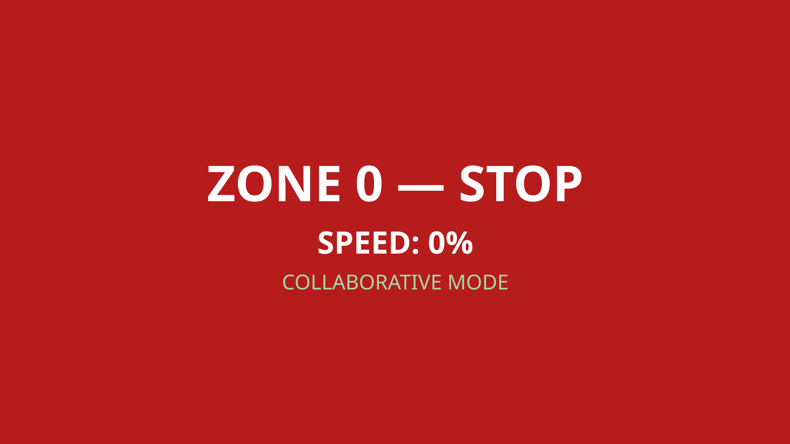

# operator_gui

Full-screen PyQt5 status display for the UR5e stand.

Shows the current zone (colour-coded background), speed percentage, and collaborative / non-collaborative mode, sized to read from 3 m on a lab monitor.
Press `Esc` to quit.



> The PyQt5 layer is AI-assisted: GUI work is outside the author's toolset, so the widget setup and styling were generated, not hand-written.

## ROS interface

### Subscribed topics

| Topic | Type | QoS | Description |
| --- | --- | --- | --- |
| `/operator/zone` | `std_msgs/Int32` | depth 10 | Current proximity zone (0 = stop) |
| `/motion/paused` | `std_msgs/Bool` | transient_local | Robot paused / at home |
| `/operator/collaborative_mode` | `std_msgs/Bool` | transient_local | Collaborative vs non-collaborative mode |
| `/speed_scaling_state_broadcaster/speed_scaling` | `std_msgs/Float64` | depth 10 | Actual UR speed-scaling factor, shown as the speed percentage |

### Parameters

| Parameter | Default | Description |
| --- | --- | --- |
| `zone_topic` | `/operator/zone` | Zone input topic |
| `paused_topic` | `/motion/paused` | Paused-state topic (latched) |
| `collaborative_mode_topic` | `/operator/collaborative_mode` | Collaborative-mode topic (latched) |
| `speed_scaling_topic` | `/speed_scaling_state_broadcaster/speed_scaling` | Speed-scaling topic of the UR driver |
| `qos_depth` | `10` | Subscriber queue depth for the zone and speed streams |

Defaults live in `config/operator_gui.yaml`, loaded by the launch file.

## Build

```bash
colcon build --packages-select operator_gui
source install/setup.bash
```

## Run

```bash
ros2 launch operator_gui operator_gui.launch.py
```
