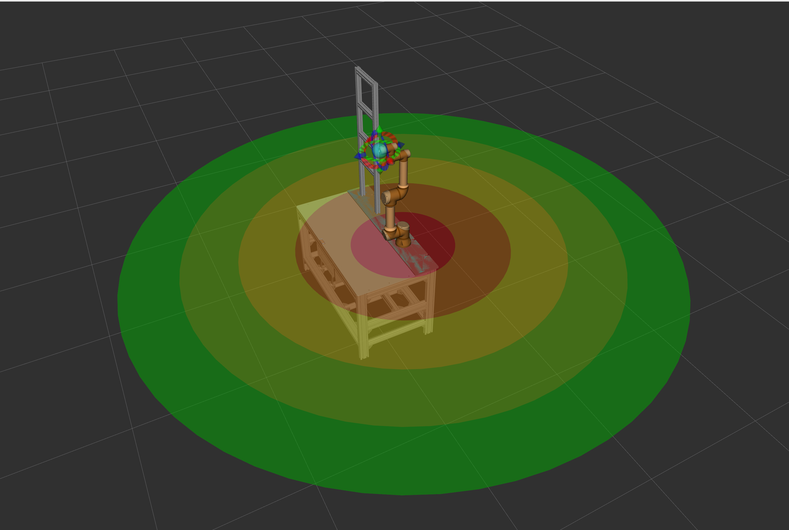

# operator_zones

Maps the operator's distance from the robot base to a discrete proximity zone.

## Overview

`zones_node` subscribes to the operator skeleton produced by `pose_detector_node`, computes the operator's distance to the robot base, picks the matching radial zone, and publishes the zone index on `/operator/zone` which is consumed by `zone_speed_controller`.

This realises Speed and Separation Monitoring (SSM), a collaborative operation method of ISO/TS 15066: concentric proximity zones that cap the robot's speed by how close the operator is.

The zone markers on `/operator/zone_markers` are for RViz visualisation only.



## ROS interface

### Subscribed topics

| Topic | Type | Description |
| --- | --- | --- |
| `/pose/operator_skeleton` | `geometry_msgs/PoseArray` | 33-joint operator skeleton from `kinect_pose_detector`, in its `target_frame` (default `world`) |

### Published topics

| Topic | Type | Description |
| --- | --- | --- |
| `/operator/zone` | `std_msgs/Int32` | Zone index of the detected operator; published only for frames with a valid detection |
| `/operator/zone_markers` | `visualization_msgs/MarkerArray` | One filled ring per zone for RViz, refreshed at 0.5 Hz |

### Parameters

| Parameter | Default | Unit | Description |
| --- | --- | --- | --- |
| `robot_base_frame` | `ur5e_base_link` | — | TF frame of the robot base, including any URDF prefix; looked up against `reference_frame` each callback. Empty disables TF and uses the static position |
| `robot_base_x` / `_y` / `_z` | `1.05` / `0.69` / `0.01` | m | Static robot base position in `reference_frame`, used when `robot_base_frame` is empty, and until the first successful TF lookup |
| `danger_radius` | `0.5` | m | Fixed outer boundary of zone 0 (the stop zone) |
| `workspace_radius` | `2.6` | m | Outer boundary of the working space |
| `num_zones` | `5` | — | Total zones including zone 0; must match `num_zones` in `zone_speed_controller` |
| `tracked_joints` | wrists, shoulders, hips, nose | — | Joint names used for the primary distance estimate |
| `reference_frame` | `world` | — | Frame the skeleton is in and the base is looked up against; must match `pose_detector` `target_frame` |
| `operator_skeleton_topic` | `/pose/operator_skeleton` | — | Skeleton input topic |
| `zone_topic` | `/operator/zone` | — | Zone output topic |
| `zone_markers_topic` | `/operator/zone_markers` | — | RViz marker output topic |
| `qos_depth` | `10` | — | Subscriber/publisher queue depth |

Defaults live in `config/zones_node.yaml`, loaded by the launch file.
Marker visuals (ring opacity, circle resolution, refresh period) are fixed module constants in the node, not parameters.

## Build

```bash
colcon build --packages-select operator_zones
source install/setup.bash
```

## Run

```bash
ros2 launch operator_zones zones_node.launch.py
```

The node also runs standalone with its built-in defaults (TF lookup disabled, static base at the `world` origin):

```bash
ros2 run operator_zones zones_node
```

## Zone model

Zones are radial shells around the robot base in the `reference_frame` (default `world`), numbered from the base outward.

Zone 0 is the stop zone, bounded by `danger_radius`.
The remaining `num_zones - 1` boundaries are spread evenly between `danger_radius` ($r_0$) and `workspace_radius` ($r_w$):

$$
b_i = r_0 + (r_w - r_0)\, \frac{i}{N - 1}, \quad i = 1 \dots N - 2
$$

`num_zones` zones need exactly `num_zones - 1` boundaries.
For the shipped defaults ($r_0 = 0.5$, $r_w = 2.6$, $N = 5$) the step is $0.525$ m, giving boundaries $[0.5, 1.025, 1.55, 2.075]$ m.

| Zone | Range | Meaning |
| --- | --- | --- |
| `0` | $d < r_0$ | Stop |
| `1 .. N-2` | between consecutive boundaries | Reduced speed |
| `N-1` | $d \geq b_{N-2}$ | Full speed |

On a failed TF lookup the last known base position is held.

## Distance computation

Distance is measured in 2D on the XY plane, ignoring height:

$$
d = \sqrt{(p_x - b_x)^2 + (p_y - b_y)^2}
$$

where $(b_x, b_y)$ is the robot base and $(p_x, p_y)$ a joint position.

The estimate has two stages:

- Primary: the minimum distance over the `tracked_joints` (wrists, shoulders, hips, nose), so a reaching limb is caught even when the body is far.
- Fallback: the median distance of all valid joints, used when every tracked joint is occluded or invalid — a robust body-bulk estimate from whatever the skeleton still carries.

A frame with fewer than 33 poses, or with no valid joint at all, yields no distance: the node logs "operator not detected" and publishes no zone for that frame, leaving the last zone in force.

## Visualisation

Each zone is drawn as one flat filled ring (annulus) on the robot base plane, coloured on a red (zone 0, danger) to green (zone $N-1$, safe) gradient.
Zone 0 is a disc; the rest are rings spanning their `[inner, outer]` boundary band, so the bands do not overlap and each keeps its true colour.
