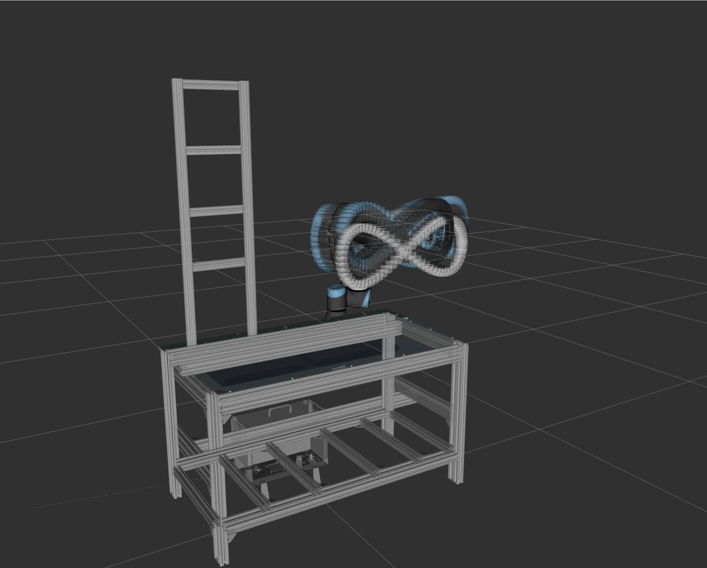

# lemniscate_executor

Executes a continuous Gerono lemniscate (figure-8) trajectory on a UR5e, with pause and home-move reactions to the operator-safety pipeline.

## Overview

`lemniscate_executor_node` builds a joint-space spline trajectory for the figure-8 and streams looping multi-cycle `FollowJointTrajectory` goals.
At runtime it reacts to two latched flags: `/motion/paused` from `zone_speed_controller` (stop in place, resume from the same phase) and `/operator/collaborative_mode` from `gesture_detector` (park at home, resume the lemniscate on restore).
The execution speed of the running trajectory is scaled externally by `zone_speed_controller` through the UR hardware speed slider; this node only bakes the base speed (`nominal_velocity_scale`) into the trajectory timestamps.



## ROS interface

### Subscribed topics

| Topic | Type | Description |
| --- | --- | --- |
| `/motion/paused` | `std_msgs/Bool` (transient local) | `true` cancels the running goal and holds position; `false` resumes from the saved phase |
| `/operator/collaborative_mode` | `std_msgs/Bool` (transient local) | `false` parks the arm at home; `true` returns it to the lemniscate (subscribed after MoveIt startup) |

### Actions called

| Action | Type | Description |
| --- | --- | --- |
| `/<controller_name>/follow_joint_trajectory` | `control_msgs/FollowJointTrajectory` | All motion, including startup and home moves |

### Services called

| Service | Type | Description |
| --- | --- | --- |
| `/io_and_status_controller/set_speed_slider` | `ur_msgs/SetSpeedSliderFraction` | Slider reset to 1.0 at startup and before every home move; skipped with a warning when the service is unavailable |

### Parameters

| Parameter | Default | Unit | Description |
| --- | --- | --- | --- |
| `planning_group` | `ur5e_arm` | — | MoveIt planning group |
| `centre.x` / `.y` / `.z` | `1.19` / `0.20` / `0.50` | m | Lemniscate centre in the planning frame |
| `centre.roll` / `.pitch` / `.yaw` | $-\pi$ / $\pi/2$ / $\pi/2$ | rad | Tool orientation at every waypoint |
| `amplitude.x` / `.z` | `0.30` / `0.20` | m | Lemniscate half-extents in X and Z |
| `samples_per_loop` | `200` | — | Unique Cartesian via-points per figure-8; IK is solved for each |
| `nominal_velocity_scale` | `0.25` | — | Base speed as a fraction of joint maximum velocity, baked into the spline |
| `num_cycles` | `10` | — | Lemniscate cycles per trajectory goal ($\approx 2.9$ MB per 10 cycles) |
| `dt` | `0.01` | s | Trajectory discretisation step; 100 Hz matches the controller interpolation period |
| `controller_name` | `scaled_joint_trajectory_controller` | — | Action server prefix; use `joint_trajectory_controller` on mock hardware (no speed scaling) |
| `paused_topic` | `/motion/paused` | — | Pause flag input topic |
| `collaborative_mode_topic` | `/operator/collaborative_mode` | — | Collaborative-mode input topic |
| `speed_slider_service` | `/io_and_status_controller/set_speed_slider` | — | UR speed slider service |

Defaults live in `config/lemniscate_executor.yaml`, loaded by the launch file.
The shipped orientation points the tool Z axis toward the operator at $-Y$ in the world frame: $R_z(\mathrm{yaw}) \cdot R_y(\mathrm{pitch}) \cdot R_x(\mathrm{roll}) \cdot [0,0,1]^T = [0,-1,0]^T$.

## Build

```bash
colcon build --packages-select lemniscate_executor
source install/setup.bash
```

## Run

The UR driver (or the mock stack from `bringup_mock.launch.py`) and `move_group` must already be running.

```bash
ros2 launch lemniscate_executor lemniscate_executor.launch.py
```

The launch file feeds the node the URDF/SRDF/kinematics from `cocohrip_moveit_config` so it can build its own robot model.
On mock hardware set `controller_name: 'joint_trajectory_controller'` in the config (see Parameters).
Mock hardware has no speed regulation: the speed slider service is absent, so slider calls are skipped and zone-based speed scaling has no effect; pause and collaborative-mode reactions still work.

## Trajectory generation

The Gerono lemniscate lies in the XZ plane (vertical figure-8, Y constant):

$$
x(t) = c_x + a_x \cos t, \qquad z(t) = c_z + a_z \sin t \cos t, \qquad t \in [0, 2\pi)
$$

The phase starts at $t = \pi/2$, so the first via-point coincides with the centre pose the arm reaches during startup.
IK is solved sequentially, each solution seeding the next, and every solution is unwrapped by multiples of $2\pi$ toward its predecessor so the joint path has no branch jumps.
Segment durations are set so the fastest joint of each segment moves at `nominal_velocity_scale` times its URDF velocity limit.
A $C^2$ periodic cubic spline (cyclic tridiagonal system, Eigen) is fitted per joint through the closed via-point loop and sampled every `dt` into goals of `num_cycles` cycles.

Mathematical formulation:

Between any two consecutive knots $x_i$ and $x_{i+1}$, the spline is represented by a unique cubic polynomial: $S_i(x) = a_i + b_i(x - x_i) + c_i(x - x_i)^2 + d_i(x - x_i)^3$

To achieve $C^2$ continuity, three conditions must be met at every interior knot $x_{i+1}$:

- Positional continuity ($C^0$): $S_i(x_{i+1}) = S_{i+1}(x_{i+1})$
- Slope continuity ($C^1$): $S'_i(x_{i+1}) = S'_{i+1}(x_{i+1})$
- Curvature continuity ($C^2$): $S''_i(x_{i+1}) = S''_{i+1}(x_{i+1})$

The periodic boundary closes the loop: the same three conditions are enforced between the last and the first segment, which replaces the natural-spline end conditions and turns the tridiagonal system into a cyclic one.

## Runtime behaviour

- Seamless looping: a successor goal is sent when the running goal enters its final cycle (proactive stitching), so the controller's point buffer never drains and the seam velocity matches by periodicity.
  Stale results of superseded goals are filtered by goal id.
- Pause: `/motion/paused = true` cancels the goal; the trajectory-time phase from action feedback (already compensated for the UR slider scaling) is saved, and `false` resumes from exactly that phase.
- Non-collaborative mode: the goal is cancelled via the pause flag, then a worker thread sets the slider to 1.0 and parks the arm at home.
  On restore it returns through home to the lemniscate start pose and restarts at phase 0.
- All moves, including MoveIt home plans, are executed through the trajectory action: MoveIt's own execution monitor computes its deadline from the planned duration and misfires when the UR slider stretches real execution time.

## Threading model

`main()` spins a `MultiThreadedExecutor` in a background thread and calls `run()` once; action callbacks drive the infinite loop afterwards.
Long-blocking home transitions run on a single owned worker thread, posted as jobs by the subscription callbacks; shared state is guarded by one mutex that is never held across a MoveIt or action call.

## Known limitations

The pause / collaborative-mode / stitching state machine lives in the action and subscription callbacks and shares state under the mutex; it is verified on the stand and is not unit-testable without ROS.
The geometric and timing layers (`lemniscate.cpp`, `cubic_spline.hpp`) are pure and testable in isolation.